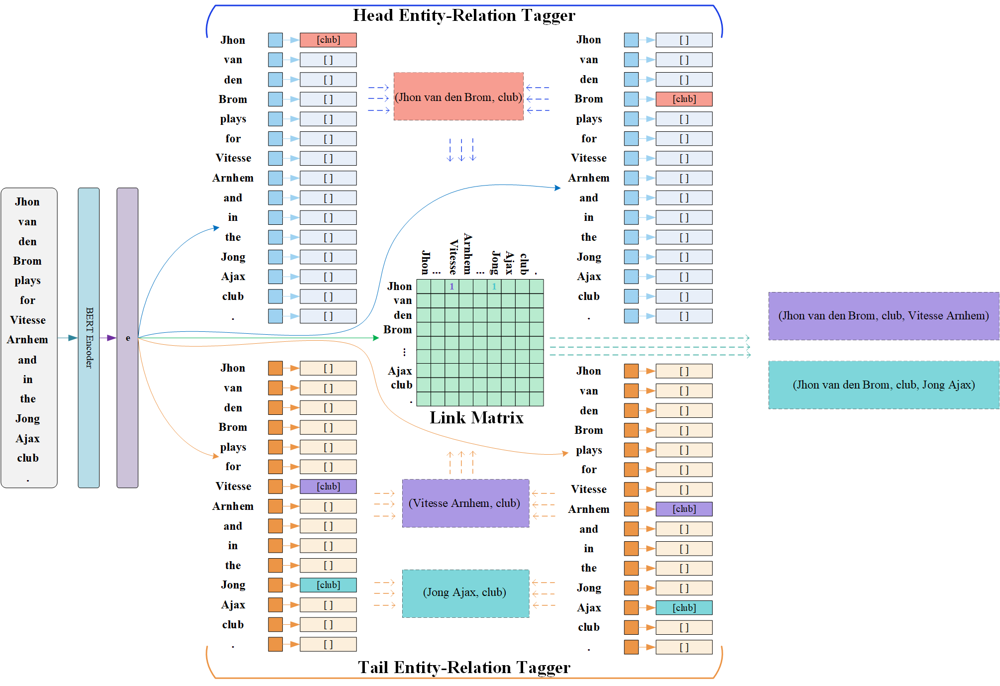

# H2O2Net: A Novel Entity-Relation Linking Network for Joint Relational Triple Extraction

This repository contains the source codes and datasets for the paper: **H2O2Net: A Novel Entity-Relation Linking Network for Joint Relational Triple Extraction.** 

## Overview



## Requirements

The main requirements are:

  - python==3.7.7
  - pytorch==1.6.0
  - transformers==4.25.1
  - tqdm==4.46.0
  - numpy==1.18.5
  - pandas==1.2.0

## Datasets

- [NYT*](https://github.com/weizhepei/CasRel/tree/master/data/NYT) and [WebNLG*](https://github.com/weizhepei/CasRel/tree/master/data/WebNLG)(following [CasRel](https://github.com/weizhepei/CasRel))
- [NYT](https://drive.google.com/file/d/1kAVwR051gjfKn3p6oKc7CzNT9g2Cjy6N/view)(following [CopyRE](https://github.com/xiangrongzeng/copy_re))
- [WebNLG](https://github.com/yubowen-ph/JointER/tree/master/dataset/WebNLG/data)(following [ETL-span](https://github.com/yubowen-ph/JointER))

Or you can just download the preprocessed [datasets](https://drive.google.com/file/d/1hpUedGxzpg6lyNemClfMCeTXeaBBQ1u7/view?usp=sharing) released by PRGC.

## Usage

**1. Get pre-trained BERT model for PyTorch**

Download [BERT-Base-Cased](https://huggingface.co/bert-base-cased/tree/main) which contains `pytroch_model.bin`, `vocab.txt` and `config.json`. Put these under `./pretrain_models`.

**2. Build Data**

Put the preprocessed datasets under `./data`.

**3. Train**

Just run the script in `./scripts` by `bash train.sh`.

For example, to train the model for NYT* dataset, update the `train.sh` as:

```bash
python $pypath/train.py \
--ex_index=1 \
--epoch_num=150 \
--device_id=0 \
--corpus_type=NYT-star \
--use_head_link \
--use_amp \
```

**4. Evaluate**

Just run the script in `./scripts` by `bash evaluate.sh`.

For example, to evaluate the model for NYT* dataset, update the `evaluate.sh` as:

```bash
python $pypath/evaluate.py \
--ex_index=1 \
--device_id=0 \
--mode=test \
--corpus_type=NYT-star \
--restore_file=last \
--use_head_link \
--use_amp \
```

